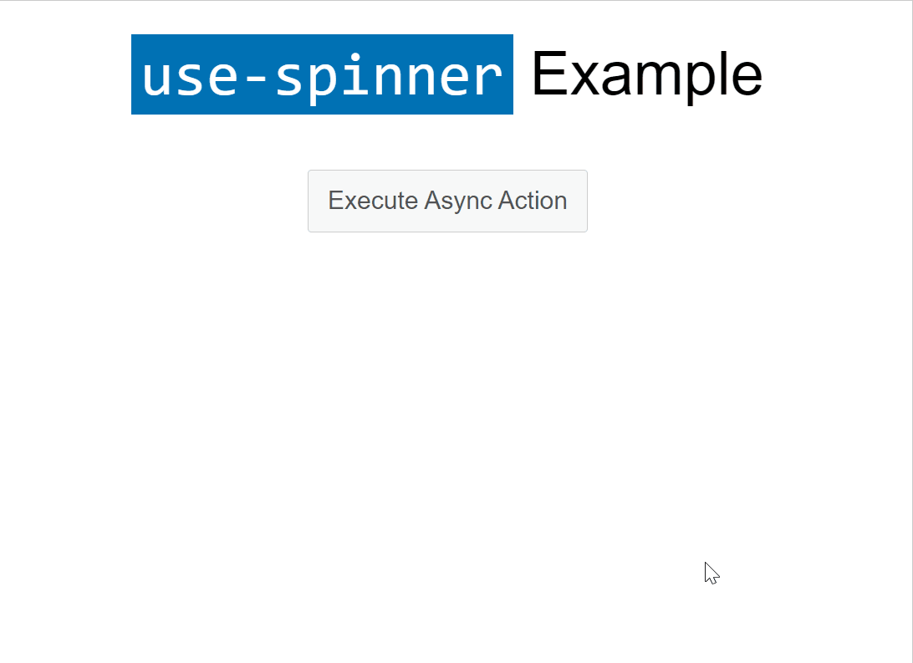

# use-spinner

[](https://github.com/pinussilvestrus/use-spinner/actions/workflows/CI.yml) 

Add a simple loading spinner to your async JS calls - built for the browser.

## Installation

```sh
$ npm install --save use-spinner
```

## Usage

```js
import useSpinner from 'use-spinner';

import 'use-spinner/assets/use-spinner.css';

const fn = async () => {
  await new Promise(resolve => setTimeout(() => {
    console.log('done.');
    resolve();
  }, 2000));
};

// wrap your asynchronous function
const spinnedFn = useSpinner(fn, {
  container: 'body'
});

// execute with a loading spinner
await spinnedFn();
```



## Options

The API accepts a second argument configuring the wrapped function. This defaults to:

```js
{
  container: 'body'
}
```

* *container*: a selector or a DOM element that appends the loading spinner.

## License

MIT